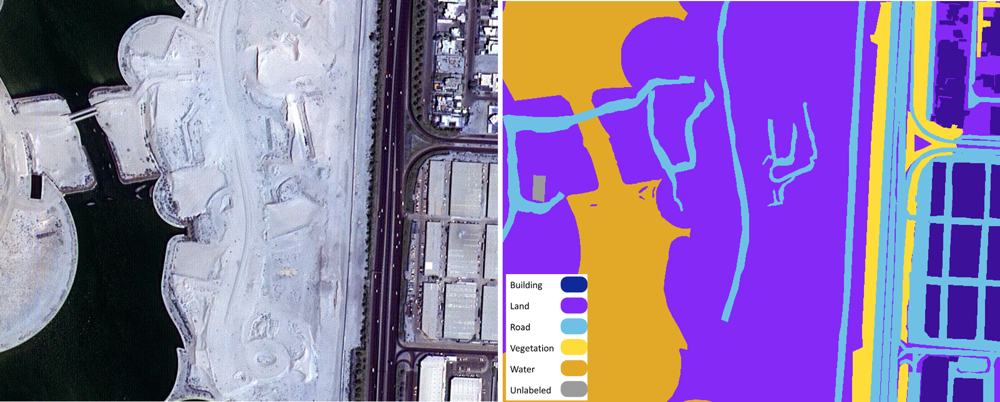

# Deep Learning for Aerial Image Classification
Semantic segmentation of aerial images with representative deep learning networks.
This is an ongoing project for the learning purpose.
UNet has been implemented and it can be used as the baseline network.
Other more recent and advanced semantic segmentation networks will be considered and added for benchmarking.

## Dataset

The used dataset is an open access dataset: ["Semantic segmentation of aerial imagery"](https://www.kaggle.com/humansintheloop/semantic-segmentation-of-aerial-imagery).
The dataset consists of 72 aerial images of Dubai acquired by MBRSC satellites and annotated with pixel-wise semantic segmentation in 6 classes:

<figure>
    
    <figcaption>Figure 1. Image and mask example.</figcaption>
</figure>

## Train
```
!python train.py --data <dataset_path> --num_epochs 10 --batch 2 --loss focalloss
```

## Inference
```
!python inference.py --model <model_path> --input <input_files> 
```

## Acknowledgements

Some code in this repository is taken from the related repositories: [U-Net: Semantic segmentation with PyTorch](https://github.com/milesial/Pytorch-UNet#readme), [dubai-satellite-imagery-segmentation](https://github.com/ayushdabra/dubai-satellite-imagery-segmentation), and [U-Net for Semantic Segmentation on Unbalanced Aerial Imagery](https://towardsdatascience.com/u-net-for-semantic-segmentation-on-unbalanced-aerial-imagery-3474fa1d3e56).
The owner would like to appreciate their great work.
